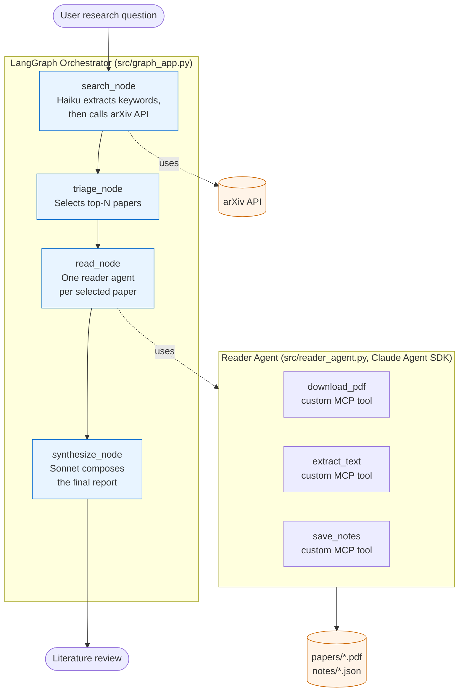

# Paper Triage Agent

A multi-agent research assistant that takes a natural-language research question, finds relevant papers on arXiv, reads them, and produces a literature-review-style answer with citations.

Built to demonstrate production patterns for agentic AI systems: Anthropic's Messages API, the Claude Agent SDK with custom MCP tools, and LangGraph for orchestration. The system runs as a CLI locally or in a Docker container, ships with a 12-test eval suite, and emits structured JSON logs.

## What it does

Given a question like *"How can retrieval augmentation reduce hallucinations in large language models?"*, the system will:

1. Translate the question into a focused arXiv keyword query (Claude Haiku)
2. Search arXiv for candidate papers
3. Select the top N for deep reading (configurable via `--max-papers`)
4. Download each paper's PDF and extract its text
5. Produce structured notes per paper: methodology, key findings, limitations, and a relevance score from 1 to 10
6. Synthesize the notes into a single literature-review-style report with citations (Claude Sonnet)

A typical run takes about 90 seconds and costs roughly $0.65 in API tokens.

The system is designed to be honest. If the search returns papers that are only tangentially related to the question, the reader scores them low and explains why, and the synthesizer says so in the final report rather than confabulating connections.

## Architecture



The system uses three different Anthropic interfaces deliberately, each chosen for what it does best:

**The Messages API** is used directly for the keyword extractor and the final synthesizer. These are stateless, single-turn calls where the simpler interface fits and a full agent loop would be wasteful.

**The Claude Agent SDK** powers the per-paper reader. Reading a paper is a multi-step task with file operations and persistent output, which is what the SDK is designed for. The reader exposes three custom MCP tools (download, extract, save) registered in-process via `create_sdk_mcp_server`.

**LangGraph** orchestrates the whole pipeline as a state machine. Each node reads from and writes to a shared `TriageState` TypedDict, which makes the pipeline checkpointable, observable, and (with minor changes) parallelizable.

## Why these three together

The short version: each technology fits a different shape of problem, and using all three demonstrates the judgment of choosing between them.

- **Messages API** for atomic, well-defined calls where the loop is trivial
- **Agent SDK** for multi-step work with file or shell operations, where the framework's pre-built tools and permission system save real engineering time
- **LangGraph** for orchestrating heterogeneous agents and stateful workflows, where the explicit state machine pays off in observability and resumability

A project that uses only one of these can't really demonstrate the judgment of choosing between them.

## Example output

For the question *"Is a CNN or Audio Spectrogram Transformer better for classifying words?"*, the system searched arXiv, downloaded two candidate papers, and produced this opening to the final report:

> The available literature does not directly address word classification, making it difficult to provide a definitive answer to this research question. Both papers compare CNNs and Audio Spectrogram Transformers (AST), but on substantially different tasks.

Both papers were given a relevance score of 2 out of 10 by the reader, and the report pointed the user toward speech-focused benchmarks (Google Speech Commands, LibriSpeech) where the actual question could be answered. The system did not pretend to have answered the question.

Full per-run output, including reader notes and the final report, is persisted under `runs/<run_id>.json`.

## Repository layout

```
paper-triage-agent/
├── src/
│   ├── __init__.py
│   ├── arxiv_tool.py         # arXiv keyword search with tenacity retries
│   ├── paper_tools.py        # PDF download and text extraction
│   ├── reader_agent.py       # Agent SDK reader with three custom MCP tools
│   ├── graph_app.py          # LangGraph orchestrator and CLI entry point
│   └── logging_setup.py      # Centralized structlog configuration
├── examples/
│   └── messages_api_agent.py # Hand-rolled Messages-API agent loop (educational)
├── tests/
│   ├── __init__.py
│   ├── test_paper_tools.py   # Unit tests for PDF helpers (fast, no API)
│   ├── test_reader_schema.py # Schema contract tests for reader (slow, calls API)
│   └── test_synthesize.py    # Citation and anti-fabrication tests (slow)
├── papers/                   # Cached PDFs (gitignored, populated at runtime)
├── notes/                    # Structured notes per paper (gitignored)
├── runs/                     # Full state per run, JSON (gitignored)
├── .dockerignore
├── .env.example              # Template for required environment variables
├── .gitignore
├── Dockerfile
├── pytest.ini
├── README.md
└── requirements.txt
```

## Tech stack

| Component | Library | Why |
|-----------|---------|-----|
| LLM provider | `anthropic`, `claude-agent-sdk` | Both interfaces deliberately exercised in different layers |
| Orchestration | `langgraph` | Stateful graph with shared TypedDict state |
| PDF parsing | `pypdf` | Pure Python, no system dependencies, portable to Docker |
| Logging | `structlog` | Structured key/value logs with one-flag JSON output for production |
| Retry policies | `tenacity` | Standard declarative retry decorator |
| Testing | `pytest` | Custom markers (`slow`) separate API-calling tests from fast unit tests |
| Config | `python-dotenv` | Loads secrets from `.env` so they never reach git |

## Running it

### Prerequisites

- Python 3.10 or higher
- An Anthropic API key (get one at [console.anthropic.com](https://console.anthropic.com))

### Local setup

```bash
git clone <this-repo-url>
cd paper-triage-agent

python3 -m venv .venv
source .venv/bin/activate   # on Windows: .venv\Scripts\activate

pip install -r requirements.txt

cp .env.example .env
# Open .env and replace the placeholder with your real API key
```

### Running with a question

Pass the question as a positional argument:

```bash
python -m src.graph_app "How can retrieval augmentation reduce hallucinations in LLMs?"
```

Or omit the argument and be prompted interactively:

```bash
python -m src.graph_app
Research question: _
```

### CLI options

```bash
python -m src.graph_app --help
```

Useful flags:

- `--max-papers N` controls how many papers to deeply read (default 2). Each paper adds about $0.30 in API cost and 40 seconds of wall time.

### Running with Docker

For a fully reproducible environment without installing Python locally:

```bash
docker build -t paper-triage .
docker run --rm --env-file .env paper-triage \
  "How can retrieval augmentation reduce hallucinations in LLMs?"
```

To persist downloaded papers and run output across container invocations, mount the relevant directories:

```bash
docker run --rm --env-file .env \
  -v $(pwd)/papers:/app/papers \
  -v $(pwd)/notes:/app/notes \
  -v $(pwd)/runs:/app/runs \
  paper-triage "your question"
```

The container defaults to `LOG_FORMAT=json` for machine-readable output suitable for log aggregators. Override with `-e LOG_FORMAT=console` for human-readable colored logs.

## Tests and evals

The project has 12 automated tests across three categories. Run them with:

```bash
python -m pytest tests/ -v                  # full suite, ~60s, costs ~$0.30
python -m pytest tests/ -v -m "not slow"    # fast tests only, <1s, no API cost
```

The suite is structured around three categories of risk:

**Pure unit tests** (`tests/test_paper_tools.py`) verify deterministic helpers like text extraction and `max_chars` truncation. No network, no LLM calls.

**Schema tests** (`tests/test_reader_schema.py`) run the reader against a cached paper and assert that the output dictionary has all required keys, that types are correct, that lists are non-empty, and that `relevance_score` falls in the range 1-10. These catch prompt regressions, model drift, and SDK upgrades that would otherwise break downstream code silently.

**Behavioral tests** (`tests/test_synthesize.py`) feed the synthesizer hand-crafted paper notes and assert that the output report cites the arxiv_ids it was given and does not invent additional citations. The anti-fabrication test uses a regex to detect anything that looks like an arxiv_id in the output and asserts the set is a subset of the allowed IDs. This catches the most dangerous failure mode for a research tool: a confident report citing papers that do not exist.

API-calling tests are tagged `@pytest.mark.slow` so the fast suite stays well under a second for local development, while the full suite runs in CI.

## Production considerations

Things that exist in the project today:

- Retry policies on external HTTP calls with exponential backoff (`tenacity`)
- Hard caps on agent loop turns and per-paper cost
- Structured logging with per-run correlation IDs (`structlog` with contextvars)
- Automated eval suite covering schema and behavioral guarantees
- Caching of downloaded PDFs to avoid redundant network calls
- Explicit tool allowlisting via the Agent SDK's permission system
- Docker image with proper layer caching and no secrets baked in

Things that would need to be added for a real production deployment:

**Smarter retry policy.** The current retry decorator treats HTTP 429 (rate limited) the same as a connection timeout, which is wrong. A 429 needs longer backoff or to honor the `Retry-After` header; a 4xx response other than 429 should not be retried at all.

**Request throttling against arXiv.** A token-bucket limiter would prevent hitting rate limits in the first place rather than reacting after the fact.

**Cost ceiling per pipeline run.** Today the system caps turns per agent but has no overall cumulative-spend cap. A wrapper that aborts if total spend exceeds a threshold would protect against runaway costs from misconfigured queries.

**LLM-as-judge evals.** The current eval suite covers schema and citation invariants. A judge eval that asks a separate model to rate the final report against quality criteria (coherence, faithfulness, hedging-appropriateness) would catch regressions in subjective qualities the current tests cannot.

**FastAPI wrapper.** Adding an HTTP layer would let the pipeline run as a service rather than a CLI invocation, which is the more useful shape for integration with other systems.

**Parallel reading.** The reader currently processes papers sequentially. LangGraph's `Send` API would let the read step fan out across papers and join their results, roughly tripling throughput on multi-paper queries.

**LangSmith integration.** Wiring `structlog` or the Agent SDK's event stream into LangSmith would give a full trace UI for debugging multi-step runs, which is the single most useful tool when an agent does something unexpected.

## What I learned building this

The most valuable lesson was that **the model is rarely the bottleneck; the scaffolding is**. A simple Claude call with a clear system prompt and structured output enforcement produces dramatically more honest and useful results than the same model in a free-form chat. The reader gives papers low relevance scores when they don't match the question, instead of confabulating connections, because the prompt and the JSON schema force it to commit to a number it has to justify.

The second lesson was about **fragility living at the integration boundary**. None of the bugs during development were in the agent logic itself. They were timeouts hitting arXiv, rate limits when development got too eager, indentation slips in deeply-nested message-handling loops, and PATH ambiguity between Anaconda and the project's virtualenv. Production agent engineering is mostly about making the messy outside world look clean to the model.